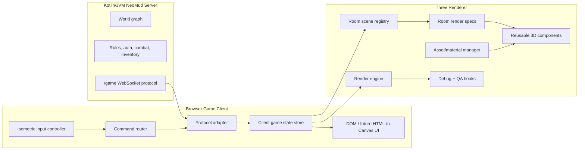
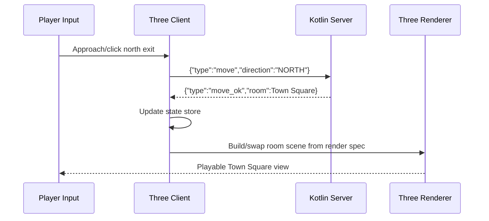
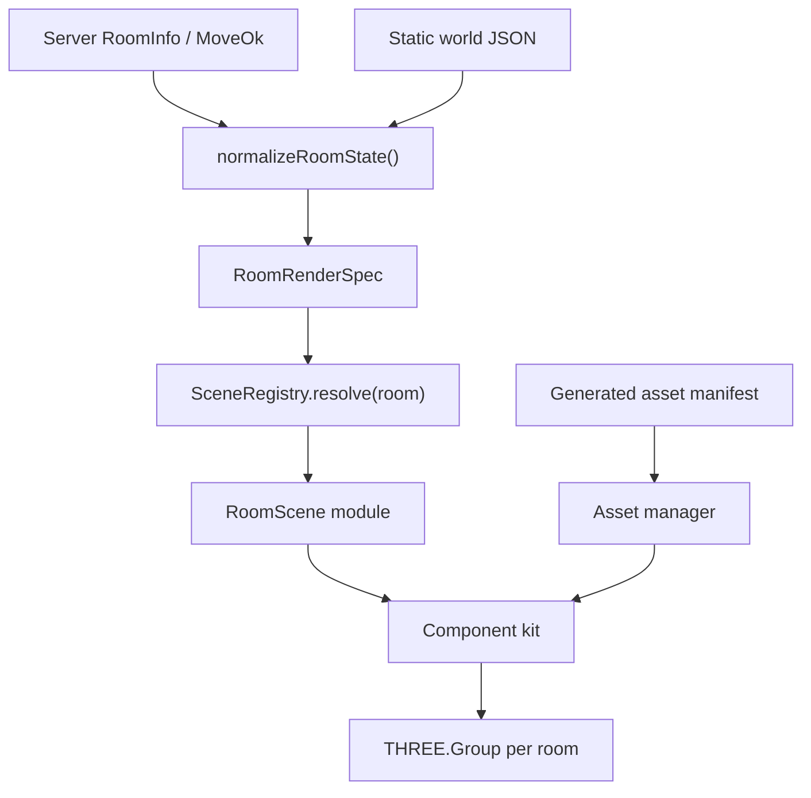
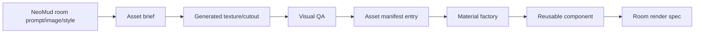

# Practical Reset Sketch

Updated: 2026-05-27

This is the reset from proof-of-concept hacking toward a real Three.js game client.

The core move: stop treating Three.js as a pile of room-specific meshes in
`app.js`. Treat it as an isometric action RPG renderer/client fed by NeoMud
server state and world content specs.

North star:

> Server-authoritative isometric action RPG client over a MUD world graph.

The gameplay reference is closer to Diablo 3 / Baldur's Gate: Dark Alliance
than a third-person RPG: elevated camera, click-to-move, click-to-interact,
clear loot/NPC/exit affordances, and room-to-room action-RPG flow. The MUD room
graph remains the world structure; the Three.js client makes each semantic room
feel like an explorable ARPG stage.

## Target Shape



## Server Boundary

The Kotlin server remains authoritative.

- Auth/session: server.
- Current room: server.
- Valid exits and locked exits: server.
- NPC/player presence: server.
- Combat, inventory, dialogue, interactables: server.
- Three.js client: input feel, camera, rendering, in-world affordances, local prediction only where safe.

The client may cache world JSON and generated assets, but server messages decide what is true.



## Renderer Reset

The renderer should become a small engine with explicit layers:



### Proposed Modules

- `game-state.js`: normalized current room, player, NPCs, inventory, messages, server status.
- `command-router.js`: `move`, `look`, `interact`, `inventory`, `combat` commands; chooses server or offline fallback.
- `render-engine.js`: owns renderer, scene, camera, root groups, lights, render loop.
- `scene-registry.js`: maps room ids/tags to scene builders.
- `room-specs.js`: converts NeoMud rooms into practical render instructions.
- `components/`: floors, walls, portals, buildings, windows, arches, signs, billboards, NPC markers, lights.
- `assets/manifest.js`: generated texture/cutout metadata, repeat scale, alpha mode, intended component use.
- `qa-hooks.js`: stable debug API for Playwright and Canary checks.

## Three.js Practices To Adopt

Use normal Three game architecture:

- One persistent renderer, scene, camera rig, and game loop.
- Elevated/isometric camera as the primary play camera; third-person chase can
  remain a debug/alternate mode, but should not drive the main UX.
- `Raycaster` ground picking for click-to-move and world-object picking for
  exits, NPCs, items, and interactables.
- One disposable `THREE.Group` for the current room/zone.
- `TextureLoader` and material cache behind an asset manager, not scattered inside room builders.
- `InstancedMesh` for repeated cobbles, stalls, columns, trees, lamps, roof tiles when counts grow.
- Bounding boxes or a simple collision map now; move to navmesh/physics only when geometry needs it.
- Later: `GLTFLoader` for proper authored/generated models instead of composing everything from boxes.

The visual rule is stricter than the technical rule: reduce noise before adding detail. Town Square should not be a ring of small decorative houses around a pasted backdrop. It should be a few large, readable, named landmarks tied to the actual room graph, with a calm low-detail exterior horizon and chunk-ring scenery beyond the playable square.

## Content Pipeline

Generated assets should become reusable content, not one-off decoration.



Asset categories:

- Tileable materials: marble, limestone, cobblestone, plaster, timber, roof tile, cloth, metal.
- Transparent cutouts: stained glass, banners, signs, shop awnings, icon plaques.
- Eventually GLTF-like models: altar, fountain, carts, stalls, doors, portals, NPC standees or character bodies.

## Room Spec Example

The room spec should be explicit enough to make visual QA meaningful:

```js
{
  roomId: "town:temple",
  kind: "cathedral",
  scale: { width: 28, length: 60, wallHeight: 11.2 },
  exits: [
    { direction: "NORTH", targetId: "town:square", portal: "arched-door", position: [0, 0, -38] }
  ],
  surfaces: {
    floor: "temple-marble",
    walls: "warm-limestone",
    trim: "aged-bronze"
  },
  features: [
    { type: "stained-glass-row", side: "EAST", count: 7, size: "large" },
    { type: "stained-glass-row", side: "WEST", count: 7, size: "large" },
    { type: "altar", position: [0, 0, -32] },
    { type: "incense", count: 2 }
  ],
  lighting: "bright-sanctuary"
}
```

## Development Phases

1. Architecture reset.
   - Extract render engine, scene registry, component kit, and game-state adapter.
   - Keep Temple/Town behavior identical while moving code.

2. Isometric ARPG control slice.
   - Add a Diablo-like elevated camera mode.
   - Add raycast ground click-to-move with a visible destination marker.
   - Make clickable exits route through the existing server-authoritative move command.
   - Keep WASD/debug movement available, but stop treating third-person chase camera tuning as the primary design center.

3. Temple quality bar.
   - Make the cathedral visually convincing: readable walls, proper windows, portal, altar, lighting, floor color patches.
   - QA with screenshots and a short manual Canary walk.

4. Town Square rebuild.
   - Stop using the flat background as the main illusion.
   - Build physical streets, building rows, stalls, fountain, roads, portals, NPC areas.
   - Use the original generated image as reference/composition, not as the whole scene.

5. Gameplay surfaces.
   - NPC hover/selection.
   - Interactable prompts.
   - Inventory and dialogue panels.
   - In-world exit signs and locked-exit feedback.

5. HTML-in-Canvas experiment.
   - Put real HTML panels on in-world boards/books/doors only after the 3D world has a stable component model.
   - Keep DOM affordances accessible and hit-tested; use canvas/texture projection as the visual layer.

## QA Gates

Before each push:

- Offline renderer smoke test.
- Server-backed guest login/movement test.
- Screenshot output for Temple and Town Square.
- Manual Chrome Canary check for current visual quality.
- Memory bank update if architecture or quality bar changes.

Current truth: the server integration is real, but the renderer is still halfway between prototype and engine. This reset is the path out.
